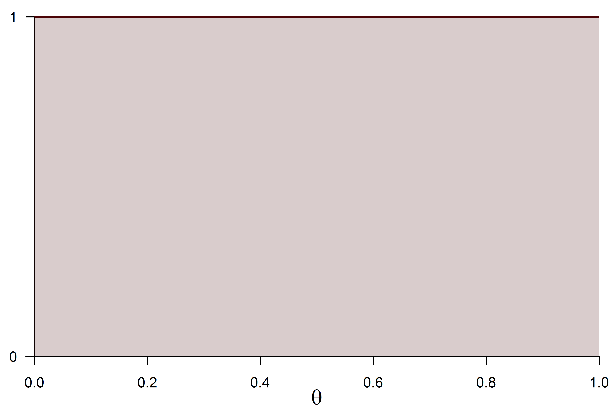
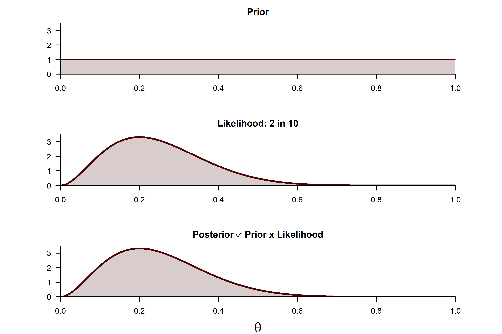
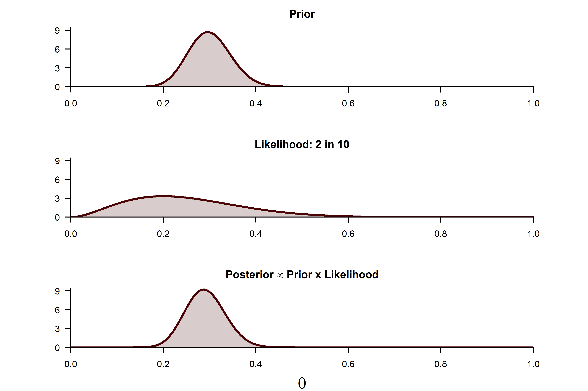
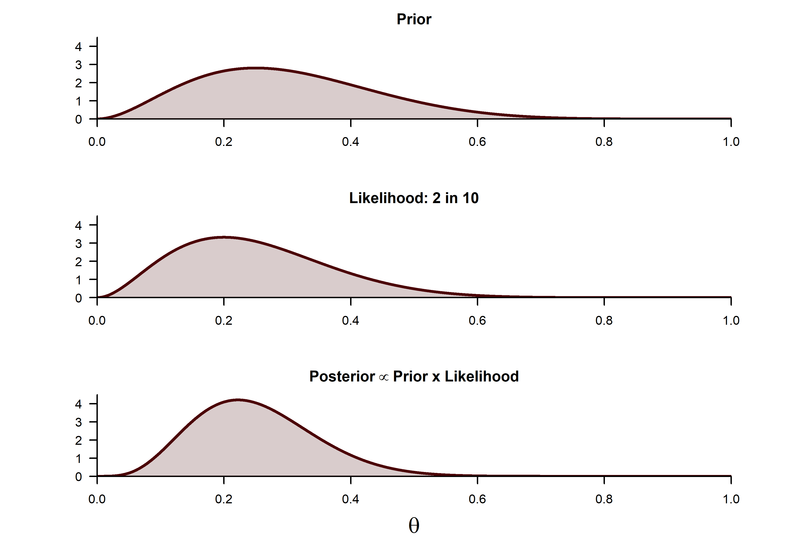

---
# The template from these slides is inspired in that from [Mark Andrews](https://github.com/mark-andrews/sips2019)
title: "Introduction to Bayesian statistics"
subtitle: "Part 1 --- Concepts"
author: |
  | Jorge N. Tendeiro
  |
  | Department of Psychometrics and Statistics
  | Faculty of Behavioral and Social Sciences
  | University of Groningen
  |   
  | \faEnvelopeO\  ```j.n.tendeiro@rug.nl```
  | \faGithub\ ```https://github.com/jorgetendeiro/GSMS-2020```
fontsize: 10pt
output:
 beamer_presentation:
 # keep_tex: true
  fonttheme: "serif"
  includes:
   in_header: include/preamble.tex
bibliography: include/references.bib
csl: 'include/apa-old-doi-prefix.csl'
nocite: |
  @forder2019hearing
---


```{r, include=FALSE}
library(ggplot2)
library(pander)
library(kableExtra)
panderOptions('round', 3)
panderOptions('keep.trailing.zeros', TRUE)
```

# Bayes rule

- $\mathcal{D}=$ data
- $\theta=$ unknown parameter

$$
\fbox{$p(\theta|\mathcal{D}) = \frac{p(\theta)p(\mathcal{D}|\theta)}{p(\mathcal{D})}$}
$$

In words,

$$
\fbox{$\text{posterior} = \frac{\text{prior} \times \text{likelihood}}{\text{evidence}}$}
$$

The *evidence* does not depend on $\theta$; let's hide it: 

$$
\fbox{$\text{posterior} \propto \text{prior} \times \text{likelihood}$}
$$
The symbol $\propto$ means "proportional to". 

# Bayes rule

$$
\fbox{$\text{posterior} \propto \text{prior} \times \text{likelihood}$}
$$


- *Prior*: Belief about the `true' value of $\theta$, *before looking at the data*.
- *Likelihood*: The statistical model, linking $\theta$ to data.
- *Posterior*: Updated knowledge about $\theta$, in light of the observed data.

# Bayes rule
One useful way to think about the Bayes rule is by considering *Approximate Bayesian Computation* (ABC; see [Wiki](https://en.wikipedia.org/wiki/Approximate_Bayesian_computation)).

- ABC is actually computationally *very* inefficient.
- But, it is *conceptually* very clear!

# Bayes rule
```{r, echo = FALSE, results = 'hide', eval = FALSE}
png(filename = "include/figures/JrAFoq5fae-prior.png", 
     width = 15, height = 10, units = "cm", pointsize = 10, res = 600)
par(mar = c(2, .8, 0, .8), bg = NA)
curve(dbeta(x, 3, 7), xaxt = "n", yaxt = "n", ylim = c(0, 2.85), 
      n = 10001, bty = "n", las = 1, col = "#4b0306", xaxs = "i", yaxs = "i", 
      xlab = "", ylab = "", main = NA, lwd = 2)
axis(1, at = c(0, .5, 1), labels = c("0", ".5", "1"), cex.axis = 2)
polygon(x = c(seq(0, 1, length.out = 100), seq(1, 0, length.out = 100)), 
        y = c(dbeta(c(seq(0, 1, length.out = 100)), 3, 7), rep(0, 100)), 
        col = rgb(75/256, 3/256, 6/256, .2), border = NA)
dev.off()

png(filename = "include/figures/3GzOCooNPt-posterior.png", 
     width = 15, height = 10, units = "cm", pointsize = 10, res = 600)
par(mar = c(2, .8, 0, .8), bg = NA)
curve(dbeta(x, 20, 50), xaxt = "n", yaxt = "n", ylim = c(0, 8), 
      n = 10001, bty = "n", las = 1, col = "#4b0306", xaxs = "i", yaxs = "i", 
      xlab = "", ylab = "", main = NA, lwd = 2)
axis(1, at = c(0, .5, 1), labels = c("0", ".5", "1"), cex.axis = 2)
polygon(x = c(seq(0, 1, length.out = 100), seq(1, 0, length.out = 100)), 
        y = c(dbeta(c(seq(0, 1, length.out = 100)), 20, 50), rep(0, 100)), 
        col = rgb(75/256, 3/256, 6/256, .2), border = NA)
dev.off()
```

```{r, child = 'include/prior_predictive_distribution.Rmd', out.width = '40%', fig.align = "center"}
```

# Bayes rule
The Bayes rule from the ABC perspective:

> Find the values of $\theta$ that allow the model to predict data pretty much like our observed data.

\vfill
Humm\ldots  

MLE, anyone?
\vfill

Bayesian inference can be thought of as an extension of MLE!

# Bayes rule -- Summary
$$
\fbox{$\text{posterior} \propto \text{prior} \times \text{likelihood}$}
$$

Bayesian modelling requires three ingredients:

- Data.
- Priors, reflecting our subjective belief about the parameters.
- A statistical model, relating parameters to data.
\vfill

Bayes rule is a mathematically rigorous means to combine prior information on *parameters* with the *data*, using the *statistical model* as the bridge between both.

# Bayes rule -- Example
Data here: [https://dasl.datadescription.com/datafile/bodyfat/](https://dasl.datadescription.com/datafile/bodyfat/){target="_blank"}. 

- Various measurements of 250 men. 
- To keep it simple: I dichotomize the percentage of body fat (PBF).
- 0 = PBF lower than 25%;  
1 = PBF larger than 25%. 
- *Goal*: Infer infer the proportion of obese men in the population.
\vfill

Let's denote the population proportion by $\theta$.

# Bayes rule -- Example
```{r echo = FALSE, fig.height = 6}
url.data <- "https://dasl.datadescription.com/download/data/3079"
PBF.data <- read.csv(url(url.data), header = TRUE, sep = "\t")
PBF      <- ifelse(PBF.data$Pct.BF > 25, 1, 0)
# prop.table(table(PBF))

bp       <- barplot(prop.table(table(PBF)), ylim = c(0, .82), #axis.lty=1, 
                    main="", xlab="", ylab = "Proportion body fat", 
                    names.arg = c("PBF < 25%", "PBF > 25%"), 
                    las = 1, col = "#4b0306")
text(bp, prop.table(table(PBF)) + .03, 
     labels = c(expression(paste("1 - ", hat(theta), " = .744")), 
                expression(paste(hat(theta), " = .256"))), cex = 1.2)
```

# Bayes rule -- Example
Let's use the Bayesian machinery. 

Recall that we need three ingredients:

- Data.
- Prior.
- Model.

# Bayes rule -- Example
- *Data.* For now, let's only use the first 10 scores.
\vfill

```{r, echo = FALSE}
kable(matrix(PBF[1:10], nrow = 1)) %>%
  kable_styling(position = "center")
```

# Bayes rule -- Example
- *Model.* We'll use the binomial model. Assumptions:
    - Independence between measurements.
    - One population with underlying rate $\theta$.
    - Random sample.

# Bayes rule -- Example
- *Prior.* We'll try several.

<!-- # Bayes rule -- Example -->
<!-- - *Prior.* To start, let's (unrealistically) assume all PBF values are equally likely. -->
<!-- \vfill -->

<!-- ```{r, echo = FALSE, results = 'hide', eval = FALSE} -->
<!-- png(filename = "include/figures/prior_beta_1_1.png",  -->
<!--      width = 15, height = 10, units = "cm", pointsize = 10, res = 600) -->
<!-- par(mar = c(3, 2, 0, .8), bg = NA) -->
<!-- curve(dbeta(x, 1, 1), ylim = c(0, 1.05), yaxt = "n",  -->
<!--       n = 10001, bty = "n", las = 1, col = "#4b0306", xaxs = "i", yaxs = "i",  -->
<!--       xlab = "", ylab = "", main = NA, lwd = 2) -->
<!-- axis(2, at = c(0, 1), las = 1) -->
<!-- polygon(x = c(seq(0, 1, length.out = 100), seq(1, 0, length.out = 100)),  -->
<!--         y = c(dbeta(c(seq(0, 1, length.out = 100)), 1, 1), rep(0, 100)),  -->
<!--         col = rgb(75/256, 3/256, 6/256, .2), border = NA) -->
<!-- mtext(expression(theta), 1, 2, cex = 1.5) -->
<!-- dev.off() -->
<!-- ``` -->

<!-- ```{r, echo = FALSE, out.width = '80%', fig.align = 'center'} -->
<!--  -->
<!-- ``` -->

# Bayes rule -- Example

```{r echo = FALSE, results = 'hide', eval = FALSE}
png(filename = "include/figures/bayesrule_beta_1_1.png", 
     width = 15, height = 10, units = "cm", pointsize = 10, res = 600)
par(mar = c(4, 6.5, 2.5, 5), bg = NA)
layout(matrix(1:3, ncol = 1))

a       <- 1
b       <- 1
PBF.use <- PBF[1:10]
obese   <- sum(PBF.use == 1)
N       <- length(PBF.use)

# Prior:
curve(dbeta(x, a, b), ylim = c(0, 3.5), yaxt = "n", 
      n = 10001, bty = "n", las = 1, col = "#4b0306", xaxs = "i", yaxs = "i", 
      xlab = "", ylab = "", main = "Prior", lwd = 2)
polygon(x = c(seq(0, 1, length.out = 100), seq(1, 0, length.out = 100)), 
        y = c(dbeta(c(seq(0, 1, length.out = 100)), a, b), rep(0, 100)), 
        col = rgb(75/256, 3/256, 6/256, .2), border = NA)
axis(2, at = c(0, 3.5), labels = c("", ""), lwd.ticks = 0)
axis(2, at = 0:3, lwd = 0, lwd.ticks = 1, las = 1)

# Likelihood:
curve(dbinom(obese, N, x) / integrate(function(x) dbinom(obese, N, x), 0, 1)$value, yaxt = "n", 
             n = 10001, bty = "n", las = 1, col = "#4b0306", xaxs = "i", yaxs = "i", 
             xlab = "", ylab = "", main = paste0("Likelihood: 2 in 10"), 
             lwd = 2, ylim = c(0, 3.5))
polygon(x = c(seq(0, 1, length.out = 100), seq(1, 0, length.out = 100)), 
        y = c(sapply(seq(0, 1, length.out = 100), function(x) dbinom(obese, N, x) / integrate(function(x) dbinom(obese, N, x), 0, 1)$value), rep(0, 100)),
        col = rgb(75/256, 3/256, 6/256, .2), border = NA)
axis(2, at = c(0, 3.5), labels = c("", ""), lwd.ticks = 0)
axis(2, at = 0:3, lwd = 0, lwd.ticks = 1, las = 1)

# Posterior:
curve(dbeta(x, a + obese, b + (N - obese)), yaxt = "n", ylim = c(0, 3.5), 
      n = 10001, bty = "n", las = 1, col = "#4b0306", xaxs = "i", yaxs = "i", 
      xlab = "", ylab = "", main = expression(bold("Posterior" %prop% "Prior x Likelihood")), 
      lwd = 2)
polygon(x = c(seq(0, 1, length.out = 100), seq(1, 0, length.out = 100)), 
        y = c(dbeta(c(seq(0, 1, length.out = 100)), a + obese, b + (N - obese)), rep(0, 100)), 
        col = rgb(75/256, 3/256, 6/256, .2), border = NA)
axis(2, at = c(0, 3.5), labels = c("", ""), lwd.ticks = 0)
axis(2, at = 0:3, lwd = 0, lwd.ticks = 1, las = 1)
mtext(expression(theta), side = 1, line = 3, cex = 1.2)
dev.off()
```

```{r, echo = FALSE, out.width = '100%', fig.align = 'center'}

```

# Bayes rule -- Example

```{r echo = FALSE, results = 'hide', eval = FALSE}
png(filename = "include/figures/bayesrule_beta_30_70.png", 
     width = 15, height = 10, units = "cm", pointsize = 10, res = 600)
par(mar = c(4, 6.5, 2.5, 5), bg = NA)
layout(matrix(1:3, ncol = 1))

a       <- 30
b       <- 70
PBF.use <- PBF[1:10]
obese   <- sum(PBF.use == 1)
N       <- length(PBF.use)

# Prior:
curve(dbeta(x, a, b), ylim = c(0, 9.5), yaxt = "n", 
      n = 10001, bty = "n", las = 1, col = "#4b0306", xaxs = "i", yaxs = "i", 
      xlab = "", ylab = "", main = "Prior", lwd = 2)
polygon(x = c(seq(0, 1, length.out = 100), seq(1, 0, length.out = 100)), 
        y = c(dbeta(c(seq(0, 1, length.out = 100)), a, b), rep(0, 100)), 
        col = rgb(75/256, 3/256, 6/256, .2), border = NA)
axis(2, at = c(0, 9.5), labels = c("", ""), lwd.ticks = 0)
axis(2, at = seq(0, 9, 3), lwd = 0, lwd.ticks = 1, las = 1)

# Likelihood:
curve(dbinom(obese, N, x) / integrate(function(x) dbinom(obese, N, x), 0, 1)$value, yaxt = "n", 
             n = 10001, bty = "n", las = 1, col = "#4b0306", xaxs = "i", yaxs = "i", 
             xlab = "", ylab = "", main = paste0("Likelihood: 2 in 10"), 
             lwd = 2, ylim = c(0, 9.5))
polygon(x = c(seq(0, 1, length.out = 100), seq(1, 0, length.out = 100)), 
        y = c(sapply(seq(0, 1, length.out = 100), function(x) dbinom(obese, N, x) / integrate(function(x) dbinom(obese, N, x), 0, 1)$value), rep(0, 100)),
        col = rgb(75/256, 3/256, 6/256, .2), border = NA)
axis(2, at = c(0, 9.5), labels = c("", ""), lwd.ticks = 0)
axis(2, at = seq(0, 9, 3), lwd = 0, lwd.ticks = 1, las = 1)

# Posterior:
curve(dbeta(x, a + obese, b + (N - obese)), yaxt = "n", ylim = c(0, 9.5), 
      n = 10001, bty = "n", las = 1, col = "#4b0306", xaxs = "i", yaxs = "i", 
      xlab = "", ylab = "", main = expression(bold("Posterior" %prop% "Prior x Likelihood")), 
      lwd = 2)
polygon(x = c(seq(0, 1, length.out = 100), seq(1, 0, length.out = 100)), 
        y = c(dbeta(c(seq(0, 1, length.out = 100)), a + obese, b + (N - obese)), rep(0, 100)), 
        col = rgb(75/256, 3/256, 6/256, .2), border = NA)
axis(2, at = c(0, 9.5), labels = c("", ""), lwd.ticks = 0)
axis(2, at = seq(0, 9, 3), lwd = 0, lwd.ticks = 1, las = 1)
mtext(expression(theta), side = 1, line = 3, cex = 1.2)
dev.off()
```

```{r, echo = FALSE, out.width = '100%', fig.align = 'center'}

```

# Bayes rule -- Example

```{r echo = FALSE, results = 'hide', eval = FALSE}
png(filename = "include/figures/bayesrule_beta_3_7.png", 
     width = 15, height = 10, units = "cm", pointsize = 10, res = 600)
par(mar = c(4, 6.5, 2.5, 5), bg = NA)
layout(matrix(1:3, ncol = 1))

a       <- 3
b       <- 7
PBF.use <- PBF[1:10]
obese   <- sum(PBF.use == 1)
N       <- length(PBF.use)

# Prior:
curve(dbeta(x, a, b), ylim = c(0, 4.5), yaxt = "n", 
      n = 10001, bty = "n", las = 1, col = "#4b0306", xaxs = "i", yaxs = "i", 
      xlab = "", ylab = "", main = "Prior", lwd = 2)
polygon(x = c(seq(0, 1, length.out = 100), seq(1, 0, length.out = 100)), 
        y = c(dbeta(c(seq(0, 1, length.out = 100)), a, b), rep(0, 100)), 
        col = rgb(75/256, 3/256, 6/256, .2), border = NA)
axis(2, at = c(0, 4.5), labels = c("", ""), lwd.ticks = 0)
axis(2, at = seq(0, 4, 1), lwd = 0, lwd.ticks = 1, las = 1)

# Likelihood:
curve(dbinom(obese, N, x) / integrate(function(x) dbinom(obese, N, x), 0, 1)$value, yaxt = "n", 
             n = 10001, bty = "n", las = 1, col = "#4b0306", xaxs = "i", yaxs = "i", 
             xlab = "", ylab = "", main = paste0("Likelihood: 2 in 10"), 
             lwd = 2, ylim = c(0, 4.5))
polygon(x = c(seq(0, 1, length.out = 100), seq(1, 0, length.out = 100)), 
        y = c(sapply(seq(0, 1, length.out = 100), function(x) dbinom(obese, N, x) / integrate(function(x) dbinom(obese, N, x), 0, 1)$value), rep(0, 100)),
        col = rgb(75/256, 3/256, 6/256, .2), border = NA)
axis(2, at = c(0, 4.5), labels = c("", ""), lwd.ticks = 0)
axis(2, at = seq(0, 4, 1), lwd = 0, lwd.ticks = 1, las = 1)

# Posterior:
curve(dbeta(x, a + obese, b + (N - obese)), yaxt = "n", ylim = c(0, 4.5), 
      n = 10001, bty = "n", las = 1, col = "#4b0306", xaxs = "i", yaxs = "i", 
      xlab = "", ylab = "", main = expression(bold("Posterior" %prop% "Prior x Likelihood")), 
      lwd = 2)
polygon(x = c(seq(0, 1, length.out = 100), seq(1, 0, length.out = 100)), 
        y = c(dbeta(c(seq(0, 1, length.out = 100)), a + obese, b + (N - obese)), rep(0, 100)), 
        col = rgb(75/256, 3/256, 6/256, .2), border = NA)
axis(2, at = c(0, 4.5), labels = c("", ""), lwd.ticks = 0)
axis(2, at = seq(0, 4, 1), lwd = 0, lwd.ticks = 1, las = 1)
mtext(expression(theta), side = 1, line = 3, cex = 1.2)
dev.off()
```

```{r, echo = FALSE, out.width = '100%', fig.align = 'center'}

```


# References
