---
# The template from these slides is inspired in that from [Mark Andrews](https://github.com/mark-andrews/sips2019)
title: "Introduction to Bayesian statistics"
subtitle: "Part 1 --- Concepts"
author: |
  | Jorge N. Tendeiro
  |
  | Department of Psychometrics and Statistics
  | Faculty of Behavioral and Social Sciences
  | University of Groningen
  |   
  | \faEnvelopeO\  ```j.n.tendeiro@rug.nl```
  | \faGlobe\ ```www.jorgetendeiro.com```
  | \faGithub\ ```https://github.com/jorgetendeiro/GSMS-2020```
fontsize: 10pt
output:
 beamer_presentation:
 # keep_tex: true
  fonttheme: "serif"
  includes:
   in_header: include/preamble.tex
bibliography: include/references.bib
csl: 'include/apa-old-doi-prefix.csl'
nocite: |
  @forder2019hearing
---


```{r, include=FALSE}
library(ggplot2)
library(pander)
library(kableExtra)
library(pscl)
panderOptions('round', 3)
panderOptions('keep.trailing.zeros', TRUE)
```

# Bayes rule

- $\mathcal{D}=$ data
- $\theta=$ unknown parameter

$$
\fbox{$p(\theta|\mathcal{D}) = \frac{p(\theta)p(\mathcal{D}|\theta)}{p(\mathcal{D})}$}
$$

In words,

$$
\fbox{$\text{posterior} = \frac{\text{prior} \times \text{likelihood}}{\text{evidence}}$}
$$

The *evidence* does not depend on $\theta$; let's hide it: 

$$
\fbox{$\text{posterior} \propto \text{prior} \times \text{likelihood}$}
$$
The symbol $\propto$ means "proportional to". 

# Bayes rule

$$
\fbox{$\text{posterior} \propto \text{prior} \times \text{likelihood}$}
$$


- *Prior*: Belief about the `true' value of $\theta$, *before looking at the data*.
- *Likelihood*: The statistical model, linking $\theta$ to data.
- *Posterior*: Updated knowledge about $\theta$, in light of the observed data.
\vfill

Let's look at the Bayes rule from various angles.

# Bayes rule -- ABC
One useful way to think about the Bayes rule is by considering *Approximate Bayesian Computation* (ABC; see [Wiki](https://en.wikipedia.org/wiki/Approximate_Bayesian_computation)).

- ABC is actually computationally *very* inefficient.
- But, it is *conceptually* very clear!

# Bayes rule -- ABC
```{r, echo = FALSE, results = 'hide', eval = FALSE}
png(filename = "include/figures/JrAFoq5fae-prior.png", 
     width = 15, height = 10, units = "cm", pointsize = 10, res = 600)
par(mar = c(2, .8, 0, .8), bg = NA)
curve(dbeta(x, 3, 7), xaxt = "n", yaxt = "n", ylim = c(0, 2.85), 
      n = 10001, bty = "n", las = 1, col = "#4b0306", xaxs = "i", yaxs = "i", 
      xlab = "", ylab = "", main = NA, lwd = 2)
axis(1, at = c(0, .5, 1), labels = c("0", ".5", "1"), cex.axis = 2)
polygon(x = c(seq(0, 1, length.out = 100), seq(1, 0, length.out = 100)), 
        y = c(dbeta(c(seq(0, 1, length.out = 100)), 3, 7), rep(0, 100)), 
        col = rgb(75/256, 3/256, 6/256, .2), border = NA)
dev.off()

png(filename = "include/figures/3GzOCooNPt-posterior.png", 
     width = 15, height = 10, units = "cm", pointsize = 10, res = 600)
par(mar = c(2, .8, 0, .8), bg = NA)
curve(dbeta(x, 20, 50), xaxt = "n", yaxt = "n", ylim = c(0, 8), 
      n = 10001, bty = "n", las = 1, col = "#4b0306", xaxs = "i", yaxs = "i", 
      xlab = "", ylab = "", main = NA, lwd = 2)
axis(1, at = c(0, .5, 1), labels = c("0", ".5", "1"), cex.axis = 2)
polygon(x = c(seq(0, 1, length.out = 100), seq(1, 0, length.out = 100)), 
        y = c(dbeta(c(seq(0, 1, length.out = 100)), 20, 50), rep(0, 100)), 
        col = rgb(75/256, 3/256, 6/256, .2), border = NA)
dev.off()
```

```{r, child = 'include/prior_predictive_distribution.Rmd', out.width = '40%', fig.align = "center"}
```

# Bayes rule -- ABC
The Bayes rule from the ABC perspective:

> Find the values of $\theta$ that allow the model to predict data pretty much like our observed data.

\vfill
Humm\ldots  

Maximum likelihood estimation, anyone?
\vfill

Bayesian inference can be thought of as an extension of MLE!

# Bayes rule -- Inverse probability
Bayes rule allows reversing conditional probabilities.

$$
\fbox{$p(\mathcal{A}|\mathcal{B}) = \frac{p(\mathcal{A})p(\mathcal{B}|\mathcal{A})}{p(\mathcal{B})}$}
$$


Consider the canonical example:

- $\mathcal{A}:$ Have disease.
- $\mathcal{B}:$ Test positive.

Then:

- $p(\mathcal{B}|\mathcal{A}):$ Probability of testing positive given that one has the disease.
\linebreak
*Test's sensitivity.*
- $p(\mathcal{A}|\mathcal{B}):$ Probability of having the disease given that (s)he tests positive.
\linebreak
*What patients really want to know.*

# Bayes rule -- Updating beliefs

Definition of probability:

- *Frequentist:* Long-run relative frequency.
\linebreak
(Problem: $p(\text{Trump winning 2020 election})$?\ldots)

- *Bayesian:* Degree of subjective belief.
\vfill

$$
\fbox{$\text{posterior} \propto \text{prior} \times \text{likelihood}$}
$$

\vfill
- Bayes rule is a rational means of updating our current belief (*prior*) by means of observed data (*likelihood*).
- *“Today's posterior is tomorrow's prior”* -- Lindley (1970)

# Bayes rule -- Summary
$$
\fbox{$\text{posterior} \propto \text{prior} \times \text{likelihood}$}
$$

Bayesian modelling requires three ingredients:

- Data.
- Priors, reflecting our subjective belief about the parameters.
- A statistical model, relating parameters to data.
\vfill

Bayes rule is a mathematically rigorous means to combine prior information on *parameters* with the *data*, using the *statistical model* as the bridge between both.

# Bayes rule -- Example
Data here: [https://dasl.datadescription.com/datafile/bodyfat/](https://dasl.datadescription.com/datafile/bodyfat/){target="_blank"}. 

- Various measurements of 250 men. 
- To keep it simple: I dichotomize the percentage of body fat (PBF).
- 0 = PBF lower than 25%;  
1 = PBF larger than 25%. 
- *Goal*: Infer the proportion of obese men in the population.
\vfill

Let's denote the population proportion by $\theta$.

# Bayes rule -- Example
```{r echo = FALSE, fig.height = 6}
url.data <- "https://dasl.datadescription.com/download/data/3079"
PBF.data <- read.csv(url(url.data), header = TRUE, sep = "\t")
PBF      <- ifelse(PBF.data$Pct.BF > 25, 1, 0)
# prop.table(table(PBF))

bp       <- barplot(prop.table(table(PBF)), ylim = c(0, .82), #axis.lty=1, 
                    main="", xlab="", ylab = "Proportion body fat", 
                    names.arg = c("PBF < 25%", "PBF > 25%"), 
                    las = 1, col = "#4b0306")
text(bp, prop.table(table(PBF)) + .03, 
     labels = c(expression(paste("1 - ", hat(theta), " = .744")), 
                expression(paste(hat(theta), " = .256"))), cex = 1.2)
```

# Bayes rule -- Example
Let's use the Bayesian machinery. 

Recall that we need three ingredients:

- Data.
- Prior.
- Model.

# Bayes rule -- Example
*Data.* For now, let's only use the first 10 scores.

- Sample size: 10
- Number of men with $\text{PBF}>25\%$: 2
- Sample proportion: $\widehat{\theta}=\frac{2}{10}=.20$

\vfill

```{r, echo = FALSE}
kable(matrix(PBF[1:10], nrow = 1)) %>%
  kable_styling(position = "center")
```

# Bayes rule -- Example
*Model.* We'll use the binomial model. Assumptions:

- Independence between measurements.
- One population with underlying rate $\theta$.
- Random sample.

# Bayes rule -- Example
*Prior.* We'll try several.

<!-- # Bayes rule -- Example -->
<!-- - *Prior.* To start, let's (unrealistically) assume all PBF values are equally likely. -->
<!-- \vfill -->

<!-- ```{r, echo = FALSE, results = 'hide', eval = FALSE} -->
<!-- png(filename = "include/figures/prior_beta_1_1.png",  -->
<!--      width = 15, height = 10, units = "cm", pointsize = 10, res = 600) -->
<!-- par(mar = c(3, 2, 0, .8), bg = NA) -->
<!-- curve(dbeta(x, 1, 1), ylim = c(0, 1.05), yaxt = "n",  -->
<!--       n = 10001, bty = "n", las = 1, col = "#4b0306", xaxs = "i", yaxs = "i",  -->
<!--       xlab = "", ylab = "", main = NA, lwd = 2) -->
<!-- axis(2, at = c(0, 1), las = 1) -->
<!-- polygon(x = c(seq(0, 1, length.out = 100), seq(1, 0, length.out = 100)),  -->
<!--         y = c(dbeta(c(seq(0, 1, length.out = 100)), 1, 1), rep(0, 100)),  -->
<!--         col = rgb(75/256, 3/256, 6/256, .2), border = NA) -->
<!-- mtext(expression(theta), 1, 2, cex = 1.5) -->
<!-- dev.off() -->
<!-- ``` -->

<!-- ```{r, echo = FALSE, out.width = '80%', fig.align = 'center'} -->
<!-- knitr::include_graphics("include/figures/prior_beta_1_1.png") -->
<!-- ``` -->

# Bayes rule -- Example
What happens if the prior is 'uninformative'?

# Bayes rule -- Example
```{r, child = 'include/bayesrule_discrete_unif.Rmd'}
```

```{r, echo = FALSE, out.width = '100%', fig.align = 'center'}
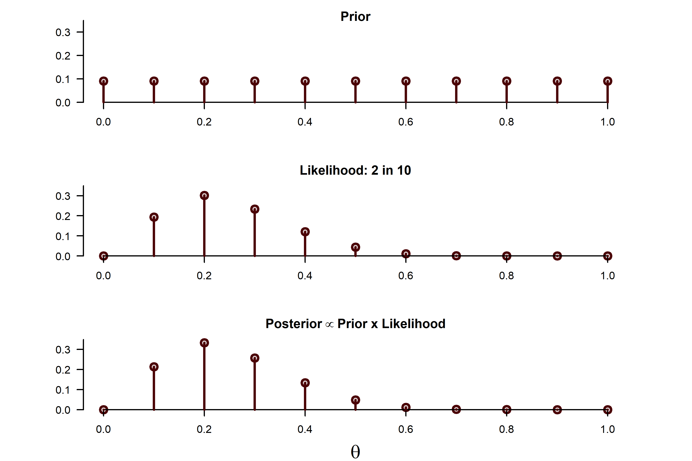
```

# Bayes rule -- Example
```{r, child = 'include/bayesrule_beta_1_1.Rmd'}
```

```{r, echo = FALSE, out.width = '100%', fig.align = 'center'}
knitr::include_graphics("include/figures/bayesrule_beta_1_1.png")
```

# Bayes rule -- Example
What happens if the prior is 'very informative'?

# Bayes rule -- Example
```{r, child = 'include/bayesrule_beta_30_70.Rmd'}
```

```{r, echo = FALSE, out.width = '100%', fig.align = 'center'}
knitr::include_graphics("include/figures/bayesrule_beta_30_70.png")
```

# Bayes rule -- Example
What happens if neither the prior nor the likelihood dominates?

# Bayes rule -- Example
```{r, child = 'include/bayesrule_beta_3_7.Rmd'}
```

```{r, echo = FALSE, out.width = '100%', fig.align = 'center'}
knitr::include_graphics("include/figures/bayesrule_beta_3_7.png")
```

# Bayes rule -- Example
```{r, child = 'include/bayesrule_beta_7_3.Rmd'}
```

```{r, echo = FALSE, out.width = '100%', fig.align = 'center'}
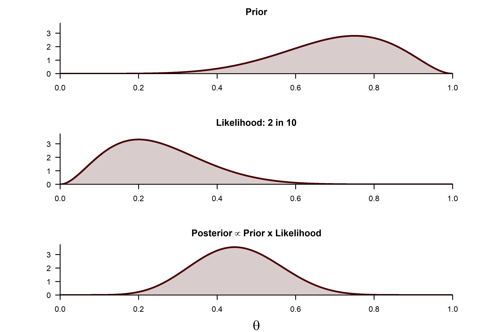
```

# Bayes rule -- Example
Let's now use all the data.

- Sample size: 250
- Number of men with $\text{PBF}>25\%$: 64
- Sample proportion: $\widehat{\theta}=\frac{64}{250}=.256$
\vfill

How does Bayes updating look like now, when the data dominate?

# Bayes rule -- Example
```{r, child = 'include/bayesrule_beta_1_1_all.Rmd'}
```

```{r, echo = FALSE, out.width = '100%', fig.align = 'center'}
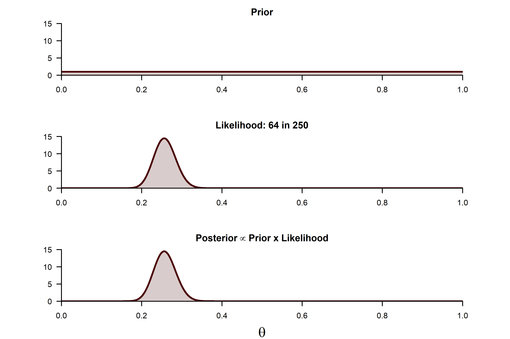
```

# Bayes rule -- Example
```{r, child = 'include/bayesrule_beta_30_70_all.Rmd'}
```

```{r, echo = FALSE, out.width = '100%', fig.align = 'center'}
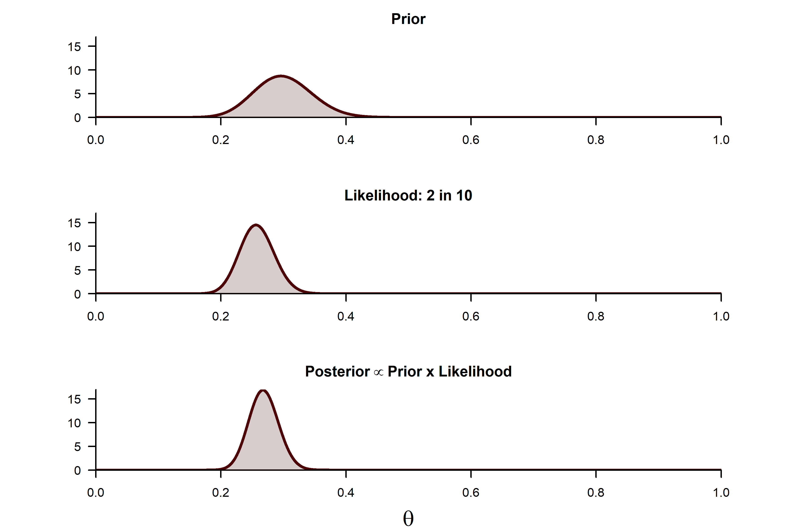
```

# Bayes rule -- Example
```{r, child = 'include/bayesrule_beta_3_7_all.Rmd'}
```

```{r, echo = FALSE, out.width = '100%', fig.align = 'center'}
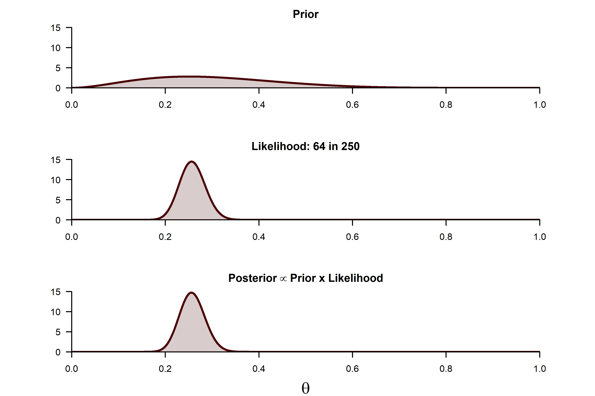
```

# Bayes rule -- Example
```{r, child = 'include/bayesrule_beta_7_3_all.Rmd'}
```

```{r, echo = FALSE, out.width = '100%', fig.align = 'center'}
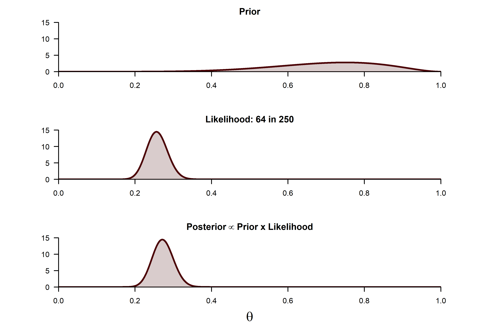
```

# Bayes rule -- Some conclusions

- Bayes rule highlights the parameter values that make the observed data look more plausible.
- The posterior distribution is a compromise between the information in the prior and the information in the data.

# Bayes rule -- Some conclusions
How do priors typically affect posterior distributions?

- For 'uninformative' priors, posterior $\approx$ likelihood.
- For 'very informative' priors, posterior $\approx$ prior.

# Bayes rule -- Some conclusions
How do data typically affect posterior distributions?

- For small sample sizes, posterior $\approx$ prior.
- For large sample sizes, posterior $\approx$ likelihood.

# Bayesian inference -- Some criticism
I think I can hear some of you thinking right now\ldots
\vfill

> "Hey, but there are sooo many posterior distributions!"

> "This seems all sooo subjective!"

> "I sooo don't like it!"

> :-(

\vfill
Fair points.

Let me offer several counter-arguments.

# Bayesian inference -- Counterarguments to criticism

1. Posterior distributions are fairly stable across a wide range of reasonable priors, *for large data sets*.
\vfill

More data $\Rightarrow$ more information $\Rightarrow$ more certainty.

# Bayesian inference -- Counterarguments to criticism
```{r, child = 'include/posteriors_all.Rmd'}
```

```{r, echo = FALSE, out.width = '100%', fig.align = 'center'}
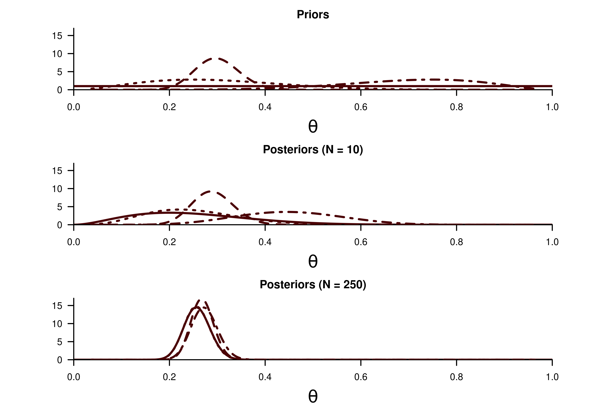
```

# Bayesian inference -- Counterarguments to criticism
2. *Illusion of certainty:* Pretending that results tell us more than is actually possible.

# Bayesian inference -- Counterarguments to criticism
There is subjectivity in each step of the scientific way:

- Selection of participants.
- Number of assessments.
- Variables to measure.
- Variables to control.
- Variability across researchers / labs.
- Statistical model to use.
- Variables to (not) include in the model.
- \ldots

Then, try topping it up with few and noisy data\ldots
\vfill

It is *fair*, *logical*, *necessary*, that statistical inference reflects uncertainty.
\vfill

Do embrace uncertainty!

# Bayesian inference -- Counterarguments to criticism
```{r, child = 'include/uncertainty.Rmd'}
```

```{r, echo = FALSE, out.width = '100%', fig.align = 'center'}
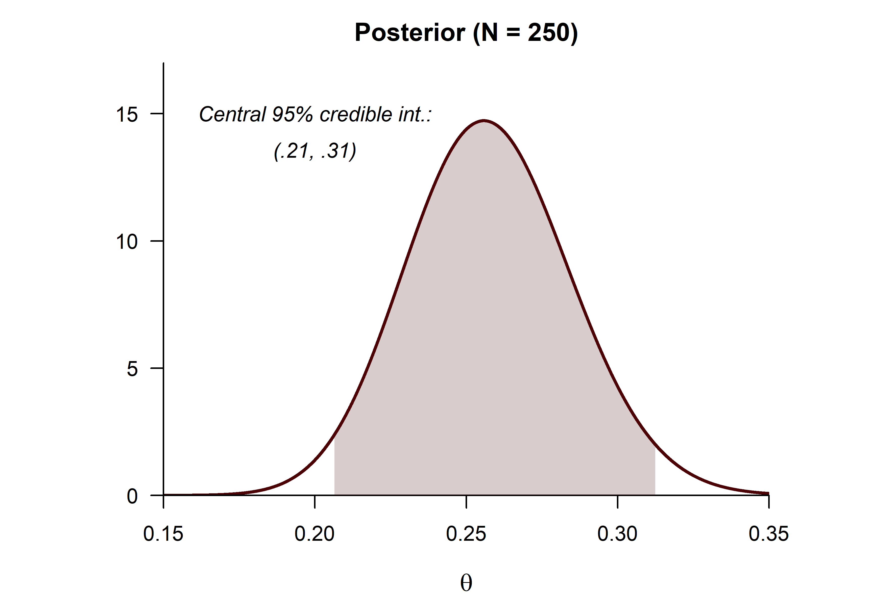
```

# Bayesian inference -- Counterarguments to criticism
3. Priors allow incorporating useful information.

- What is known about the parameter?
\vfill

Let's not pretend we do not know anything.

# Bayesian inference -- Counterarguments to criticism
```{r, child = 'include/uniform_prior.Rmd'}
```

```{r, echo = FALSE, out.width = '100%', fig.align = 'center'}
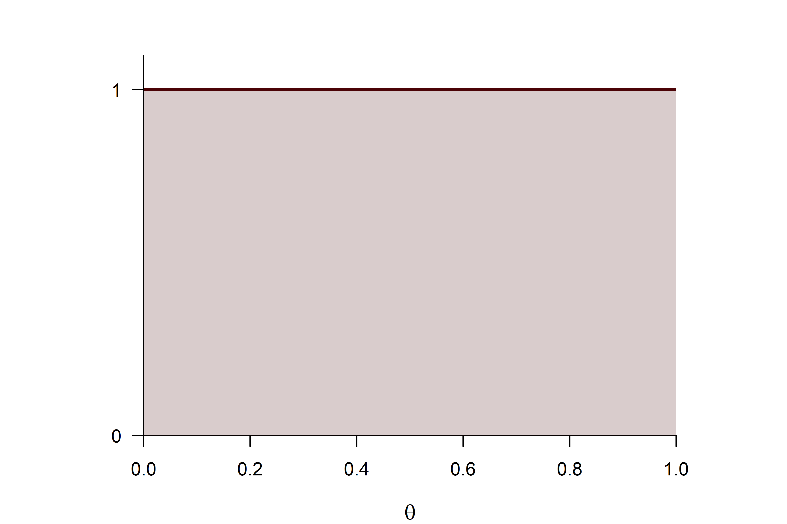
```

# Bayesian inference -- Counterarguments to criticism
About PBF:

- It is actually known that the proportion of obese men in (some\ldots) population is [about 40%](https://en.wikipedia.org/wiki/Obesity_in_the_United_States). 
- We can (we *should*!) take this into account.
- And *that* is what the prior is for.
\vfill

(Do you know how much variability to expect?
\linebreak
Then include this in the prior too!!)
\vfill

One of Bayes' advantages: Accummulation of evidence.
\linebreak 
Use it!

# Bayesian inference -- Counterarguments to criticism
```{r, child = 'include/around_40_prior.Rmd'}
```

```{r, echo = FALSE, out.width = '100%', fig.align = 'center'}
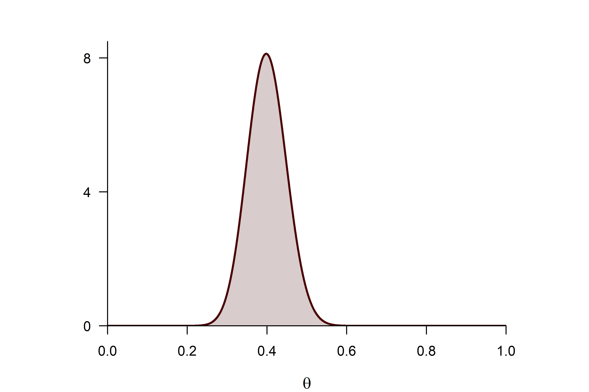
```

# Bayesian inference -- Counterarguments to criticism
Of course, strange things can occur.
\vfill

> "A Bayesian is one who, vaguely expecting a horse, and catching a glimpse of a donkey, strongly believes he has seen a mule."
\linebreak
(Stephen Senn)

\vfill
(*Inspired by [Aki Vehtari](https://twitter.com/avehtari/status/1218896617346162688) and [John Kruschke](http://doingbayesiandataanalysis.blogspot.com/2011/07/horses-donkies-and-mules.html).*)

# Bayesian inference -- Counterarguments to criticism
```{r, child = 'include/horse_donkey_mule.Rmd'}
```

```{r, echo = FALSE, out.width = '100%', fig.align = 'center'}
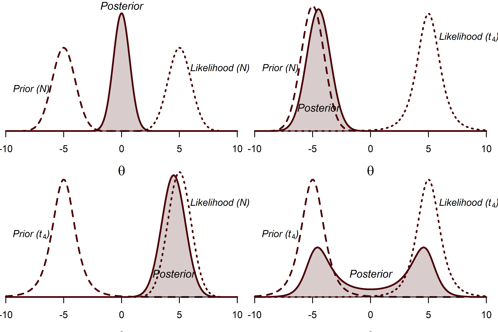
```

# Bayesian inference -- Summarize results

The posterior distribution is the *Holy Grail* in Bayesian statistics.

It reflects our current knowledge of the world, conditional on:

- The chosen model.
- The chosen prior(s).
- The observed data.
\vfill

How can we summarize the information in the posterior distribution?

# Bayesian inference -- Summarize results
```{r, child = 'include/uncertainty2.Rmd'}
```

```{r, echo = FALSE, out.width = '100%', fig.align = 'center'}
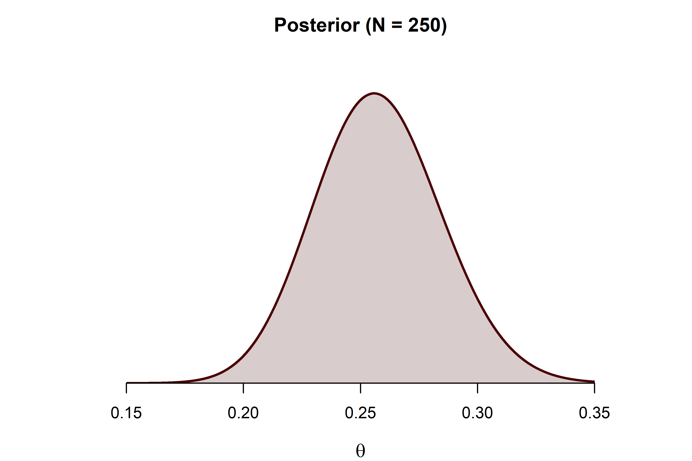
```

# Bayesian inference -- Summarize results

*Point estimates.* 
\linebreak
Commonly used:

- posterior mean
- posterior mode
- posterior median.
\vfill

For the PBF data based on 250 scores:
\begin{center}
post. mean $\approx$ post. mode $\approx$ post. median $\approx$ .26.
\end{center}
(Recall: $\widehat{\theta} = .256$.)

# Bayesian inference -- Summarize results
```{r, child = 'include/point_estimate.Rmd'}
```

```{r, echo = FALSE, out.width = '100%', fig.align = 'center'}
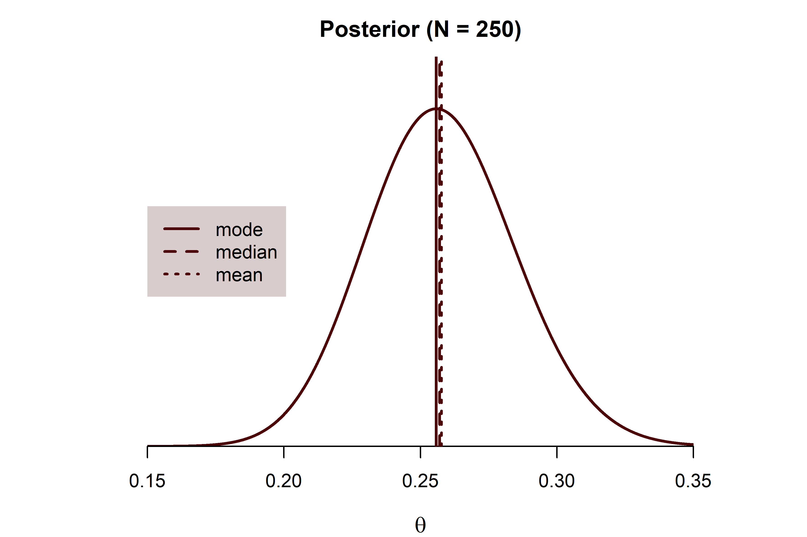
```

# Bayesian inference -- Summarize results

*Interval estimates.* 
\linebreak
I will focus on the 95% credible interval throughout.
\vfill

There are some variants (do not overly worry about these nuances):

- *Central 95% credible interval.*
\linebreak
With 2.5% probability out on each tail.
- *95% HDI (highest density interval).*
\linebreak
The shortest interval covering area .95.
\vfill

For the PBF data they practically coincide.

# Bayesian inference -- Summarize results
```{r, child = 'include/uncertainty3.Rmd'}
```

```{r, echo = FALSE, out.width = '100%', fig.align = 'center'}
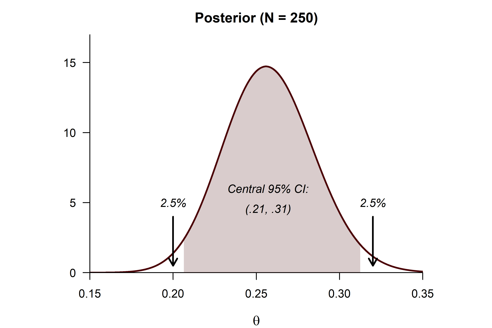
```

# Bayesian inference -- Summarize results
```{r, child = 'include/uncertainty4.Rmd'}
```

```{r, echo = FALSE, out.width = '100%', fig.align = 'center'}
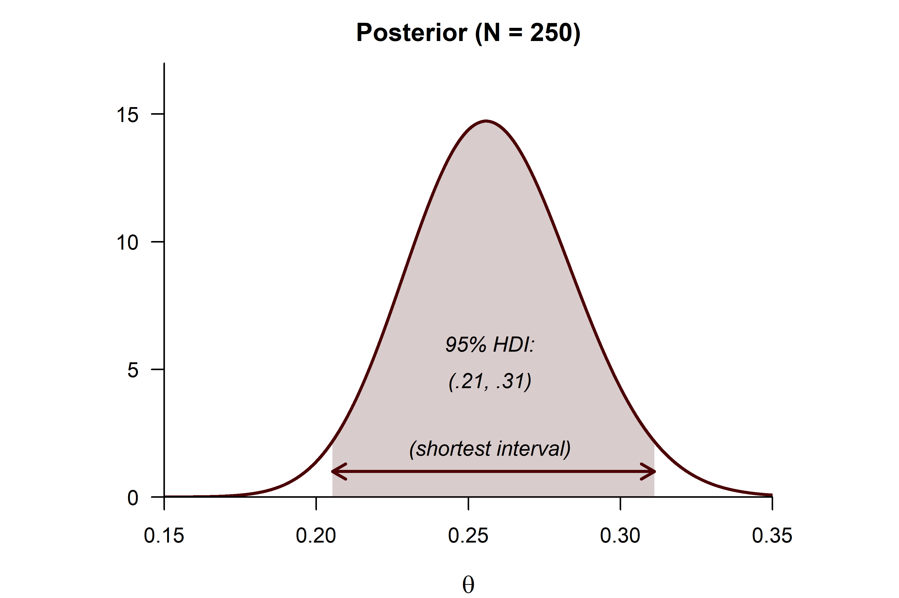
```

# Bayesian inference -- Summarize results
The posterior distribution allows computing probabilities for any events involving parameters.

For instance:

- What is the (posterior) probability that the population proportion of obese men is larger than 30%?

- What is the (posterior) probability that the population proportion of obese men is between 20% and 30%?

# Bayesian inference -- Summarize results
```{r, child = 'include/post_probs_L30.Rmd'}
```

```{r, echo = FALSE, out.width = '100%', fig.align = 'center'}
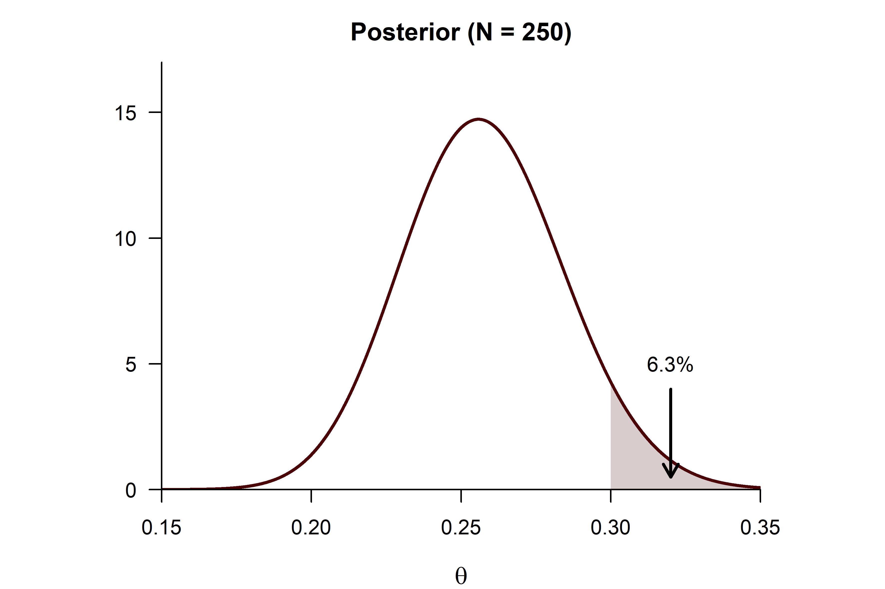
```

# Bayesian inference -- Summarize results
```{r, child = 'include/post_probs_L20_U30.Rmd'}
```

```{r, echo = FALSE, out.width = '100%', fig.align = 'center'}
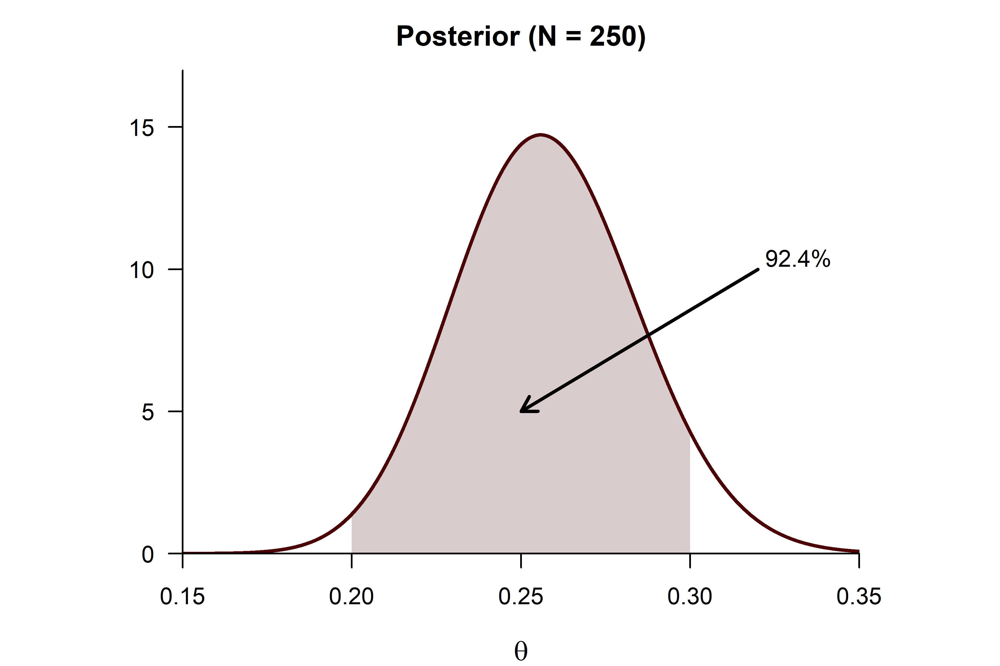
```

# Next

Specific examples will be dealt with in Part 2.

More concepts will be introduced as we proceed.
\vfill

Now where's that cup of coffee?

```{r, echo = FALSE, out.width = '40%', fig.align = 'center'}

```


