---
# The template from these slides is inspired in that from [Mark Andrews](https://github.com/mark-andrews/sips2019)
title: "Introduction to Bayesian statistics"
subtitle: "Part 2 --- Application"
author: |
  | Jorge N. Tendeiro
  |
  | Department of Psychometrics and Statistics
  | Faculty of Behavioral and Social Sciences
  | University of Groningen
  |   
  | \faEnvelopeO\  ```j.n.tendeiro@rug.nl```
  | \faGlobe\ ```www.jorgetendeiro.com```
  | \faGithub\ ```https://github.com/jorgetendeiro/GSMS-2020```
fontsize: 10pt
output:
 beamer_presentation:
 # keep_tex: true
  fonttheme: "serif"
  includes:
   in_header: include/preamble.tex
bibliography: include/references.bib
csl: 'include/apa-old-doi-prefix.csl'
nocite: |
  @forder2019hearing
---


```{r, include=FALSE}
library(ggplot2)
library(pander)
library(kableExtra)
library(pscl)
panderOptions('round', 3)
panderOptions('keep.trailing.zeros', TRUE)
```

# Worked-out example

I will illustrate Bayesian analyses by means of an example.
\vfill

General Bayesian workflow:

- Process data, descriptives.
- Build Bayesian models.
- Assess models through _prior_ predictive checks.
- Fit the models to the data.
- MCMC diagnostics.
- Assess model fit through _posterior_ predictive checks.
- Model comparison, summarize, report inferences.

# 
\begin{center}
\LARGE \textcolor{bullets}{Running example}\\
\Large Theory of mind in remitted bipolar disorder
\end{center}
\vfill

\footnotesize
_Paper:_\newline
Espinós, U., Fernandéz-Abascal, E. G., \& Ovejero, M. (2019). \textit{Theory of mind in remitted bipolar disorder: Interpersonal accuracy in recognition of dynamic nonverbal signals}. PLoS ONE, 14(9), e0222112. doi: 10.1371/journal.pone.0222112.

\textit{Data:}\newline
\url{https://www.kaggle.com/mercheovejero/theory-of-mind-in-remitted-bipolar-disorder}

# Study

_Goal:_\newline
Examine interpersonal accuracy (IPA) in remitted patients with bipolar disorder (BD).
\vfill

_Groups:_

- BD I
- BD II
- Unipolar depression (UD)
- Control
\vfill

_Dependent variable:_\newline
Number-correct score on the MiniPONS test to assess IPA.
\vfill

_Analysis:_\newline
ANCOVA model, with Age as covariate.

# Descriptives

\begin{minipage}[t]{.45\textwidth}
% Right_answers:
\begin{tabular}{lrrr}
\multicolumn{4}{c}{\itshape \textcolor{bullets}{$y$}}\\
\toprule
Group & $n$ & mean & SD\\
\midrule
BD I & 70 & 45.1 & 4.9\\
BD II & 49 & 45.7 & 4.7\\
Control & 119 & 50.2 & 3.7\\
UD & 39 & 42.7 & 5.0\\
\bottomrule
\end{tabular}
\end{minipage}
\hfill
\begin{minipage}[t]{.45\textwidth}
% Age:
\begin{tabular}{lrrr}
\multicolumn{4}{c}{\itshape \textcolor{bullets}{Age}}\\
\toprule
Group & $n$ & mean & SD\\
\midrule
BD I & 70 & 44.5 & 11.5\\
BD II & 49 & 49.9 & 11.5\\
Control & 119 & 46.1 & 10.8\\
UD & 39 & 62.9 & 9.7\\
\bottomrule
\end{tabular}
\end{minipage}
\vfill

```{r, echo = FALSE, fig.show = "hold", out.width = "49%"}
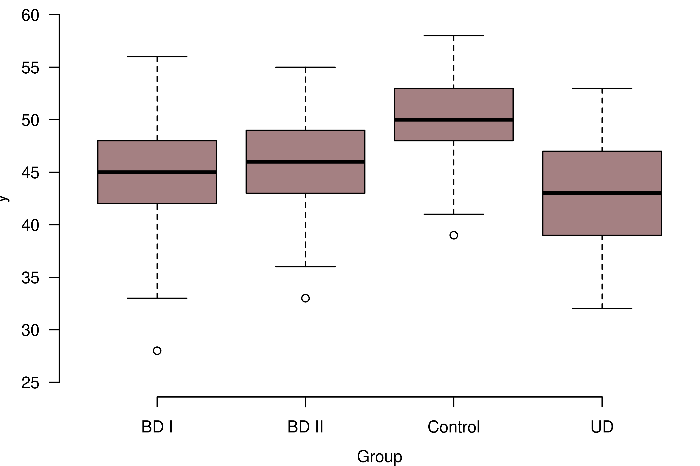
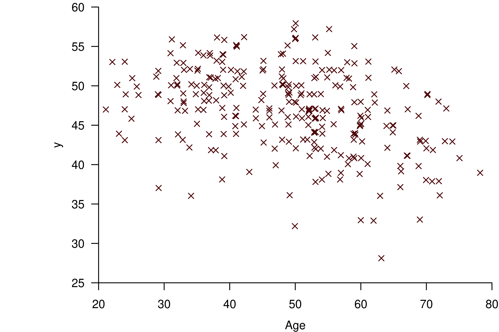
```

# Build Bayesian models
\begin{center}
\small
\begin{tabular}{cll}
\toprule
\textit{\textcolor{bullets}{Model}}           & \textit{\textcolor{bullets}{Formula}}                             & \textit{\textcolor{bullets}{Obs.}}      \\
\midrule
$\mathcal{M}_1$ & $y \sim 1$                         & baseline \\
$\mathcal{M}_2$ & $y \sim \text{Age}$                & simple regression \\
$\mathcal{M}_3$ & $y \sim \text{Group}$              & ANOVA    \\
$\mathcal{M}_4$ & $y \sim \text{Group} + \text{Age}$ & ANCOVA   \\
$\mathcal{M}_5$ & $y \sim \text{Group} + \text{Age} + \text{Group} \times \text{Age}$ & Heterog.\,slopes ANCOVA   \\ \hdashline
$\mathcal{M}_6$ & $y \sim \text{Group} + \text{Age}$ & constrained ANCOVA \\
 & & ($\mu_\text{Control} = \mu_{UD}$)   \\
\bottomrule
\end{tabular}
\end{center}
\vfill

Espinós et al. (2019) focused on the ANCOVA model, $\mathcal{M}_4$.

Here we will also consider the other models and compare them.

# Basic Stan code for all models

\footnotesize
```{r, echo = TRUE, eval = FALSE}
data {
  int<lower=0> N;   // sample size
  int<lower=0> K;   // number of predictors
  matrix[N, K+1] x; // predictor matrix (incl. intercept)
  vector[N] y;      // outcome variable
}

parameters {
  vector[K+1] beta;     // intercept + reg. coeffs.
  real<lower=0> sigma;  // SD residuals
}

model {
  beta  ~ normal(0, 10);           // Prior reg. coeffs.
  sigma ~ cauchy(0, 1);            // Prior sigma
  y     ~ normal(x * beta, sigma); // Likelihood
}
```
\normalsize

# 
\begin{center}
\LARGE \textcolor{bullets}{Assess models through\\ \textit{prior} predictive checks}
\end{center}
\vfill

# Prior predictive checks
_Ask yourself:_\newline
What type of data can my model generate, _before I fit it to my own data_?
\vfill

_Answer:_\newline
Perform \textcolor{bullets}{prior predictive checks}.
\vfill

_What's that?_\newline
Look at data generated from your model (i.e., likelihood + priors).\newline
$\longrightarrow$ Akin to test-driving a car before buying it.
\vfill

_What am I looking for?_\newline
A model that is flexible enough, but not too wild.

# ANCOVA model
\footnotesize
```{r, echo = TRUE, eval = FALSE}
model {
  beta  ~ normal(0, 10);           // Prior reg. coeffs.
  sigma ~ cauchy(0, 1);            // Prior sigma
  y     ~ normal(x * beta, sigma); // Likelihood
}
```
\normalsize
\vfill

To sample from the prior predictive distribution, do this a few times:

- Sample beta from its prior $\mathcal{N}(0, 10)$, say $\text{beta}_i$.
- Sample sigma from its prior $\text{Cauchy}(0, 1)$, say $\text{sigma}_i$.
- Sample data from the likelihood $\mathcal{N}(x * \text{beta}_i, \text{sigma}_i)$, say $y_i$.
- Plot $y_i$.

# ANCOVA model
```{r, echo = FALSE, fig.align = "center", out.width = "100%"}
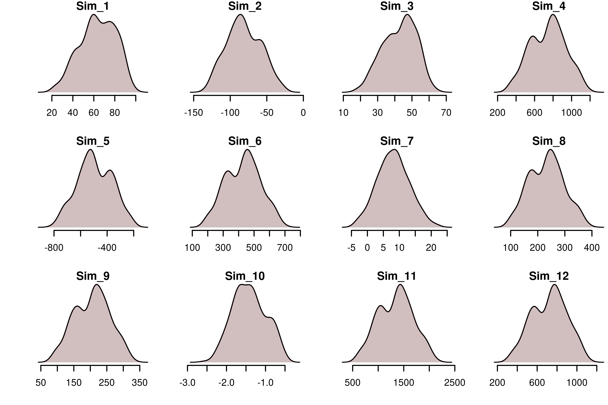
```

_Flexible._

# ANCOVA model
What if we broaden the prior on beta?
\vfill

```{r, echo = FALSE}
colorize <- function(x, color) {
  sprintf("\\textcolor{%s}{%s}", color, x)
}
```

\footnotesize
```{r, echo = TRUE, eval = FALSE}
model {
  beta  ~ normal(0, 100);          // Prior reg. coeffs.
  sigma ~ cauchy(0, 1);            // Prior sigma
  y     ~ normal(x * beta, sigma); // Likelihood
}
```
\normalsize

# ANCOVA model
```{r, echo = FALSE, fig.align = "center", out.width = "100%"}
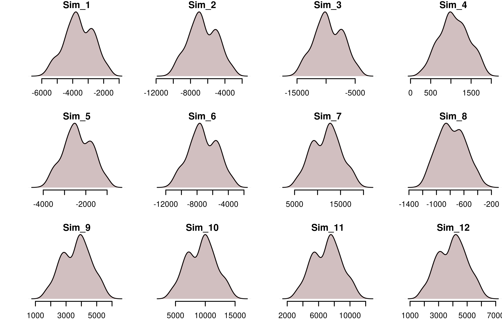
```

_Yikes._

# ANCOVA model
What if we shrink the prior on beta?
\vfill

```{r, echo = FALSE}
colorize <- function(x, color) {
  sprintf("\\textcolor{%s}{%s}", color, x)
}
```

\footnotesize
```{r, echo = TRUE, eval = FALSE}
model {
  beta  ~ normal(0, .1);           // Prior reg. coeffs.
  sigma ~ cauchy(0, 1);            // Prior sigma
  y     ~ normal(x * beta, sigma); // Likelihood
}
```
\normalsize

# ANCOVA model
```{r, echo = FALSE, fig.align = "center", out.width = "100%"}
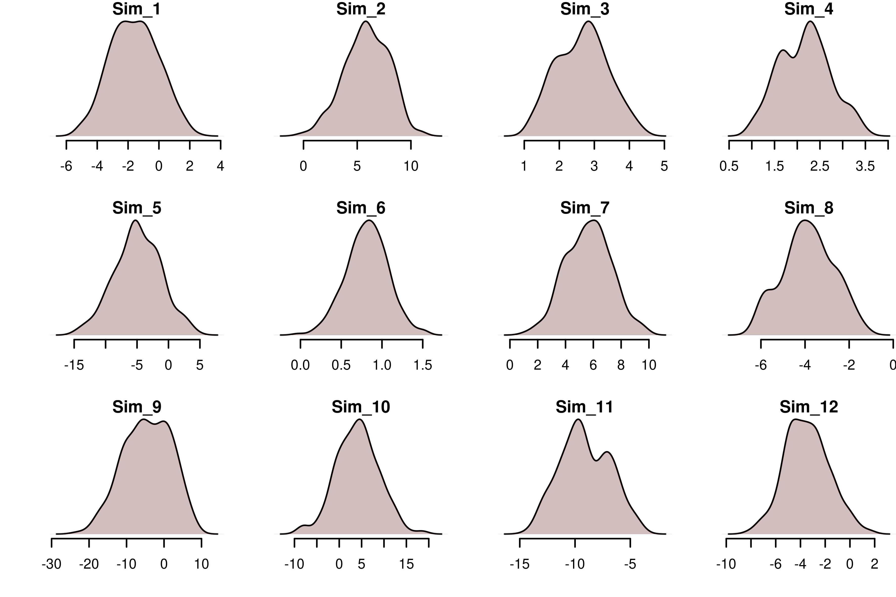
```

_Ups._

# Fit the models to the data
I used R and rstan for the job.\vfill
All code is available at: \url{https://github.com/jorgetendeiro/GSMS-2020}.

# 
\begin{center}
\LARGE \textcolor{bullets}{MCMC diagnostics}
\end{center}
\vfill

# Trace plot
```{r, echo = FALSE, fig.align = "center", out.width = "100%"}
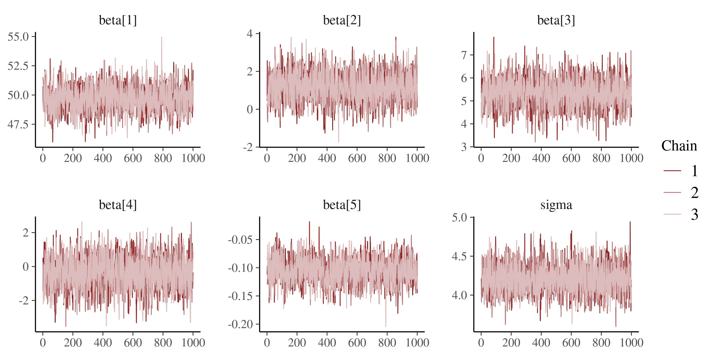
```

The chains mixed well.

# R-hat
```{r, echo = FALSE, fig.align = "center", out.width = "100%"}
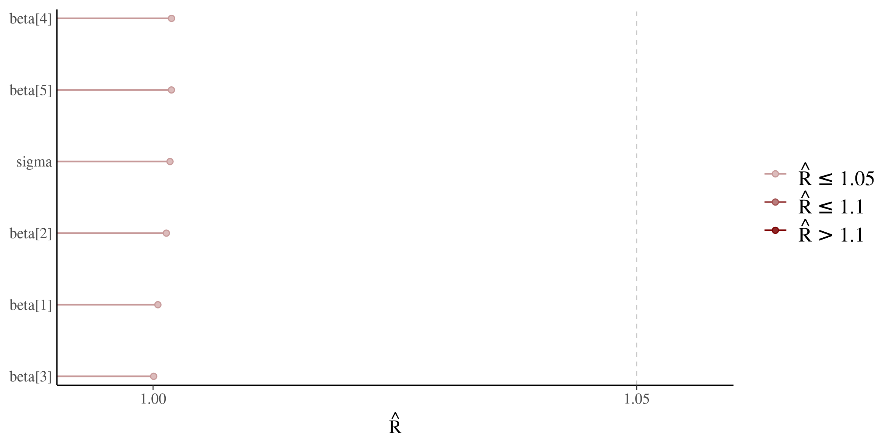
```

All below, say, 1.05. Good.

# Effective sample size
```{r, echo = FALSE, fig.align = "center", out.width = "100%"}
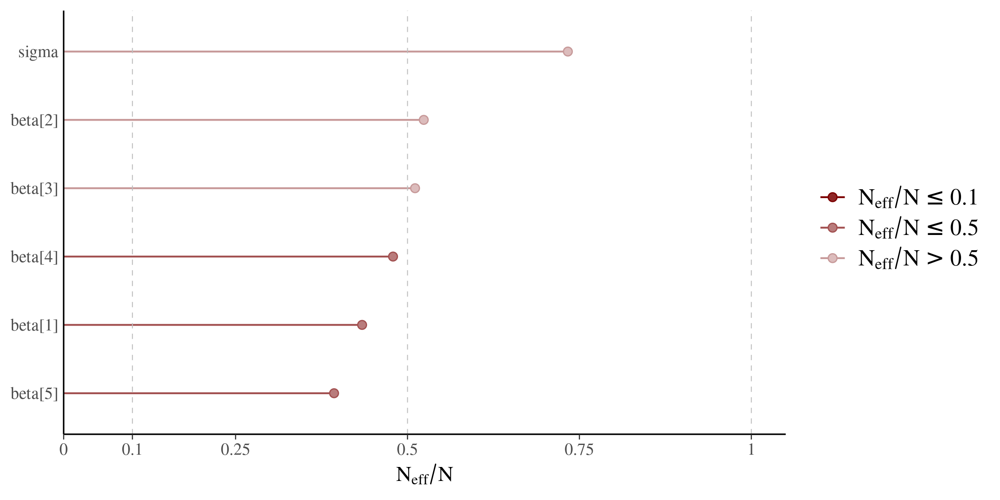
```

All above, say, 0.1. Good.

# Auto-correlation
```{r, echo = FALSE, fig.align = "center", out.width = "100%"}
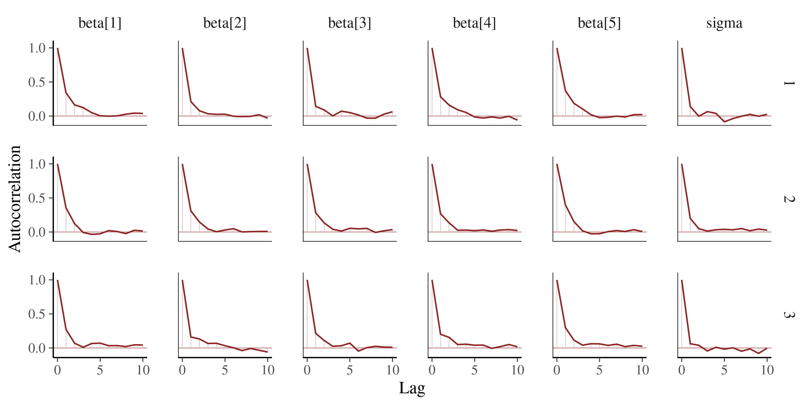
```

It approaches 0 rather quickly. Nice.

# 
\begin{center}
\LARGE \textcolor{bullets}{Assess model fit through\\ \textit{posterior} predictive checks}
\end{center}
\vfill

# Posterior predictive checks
_Ask yourself:_\newline
How likely is your fitted model of generating data _like_ you collected?
\vfill

_Answer:_\newline
Perform \textcolor{bullets}{posterior predictive checks}.
\vfill

_What's that?_\newline
Compare observed data to data generated from your _fitted_ model.\newline
$\longrightarrow$ Assess model fit.
\vfill

_What am I looking for?_\newline
Evidence that your data _could have been_ generated from the fitted model.

# Posterior predictive checks
Let's first focus on the ANCOVA model $\mathcal{M}_4$.
\vfill

# Distribution of $y$
```{r, echo = FALSE, fig.align = "center", out.width = "100%"}
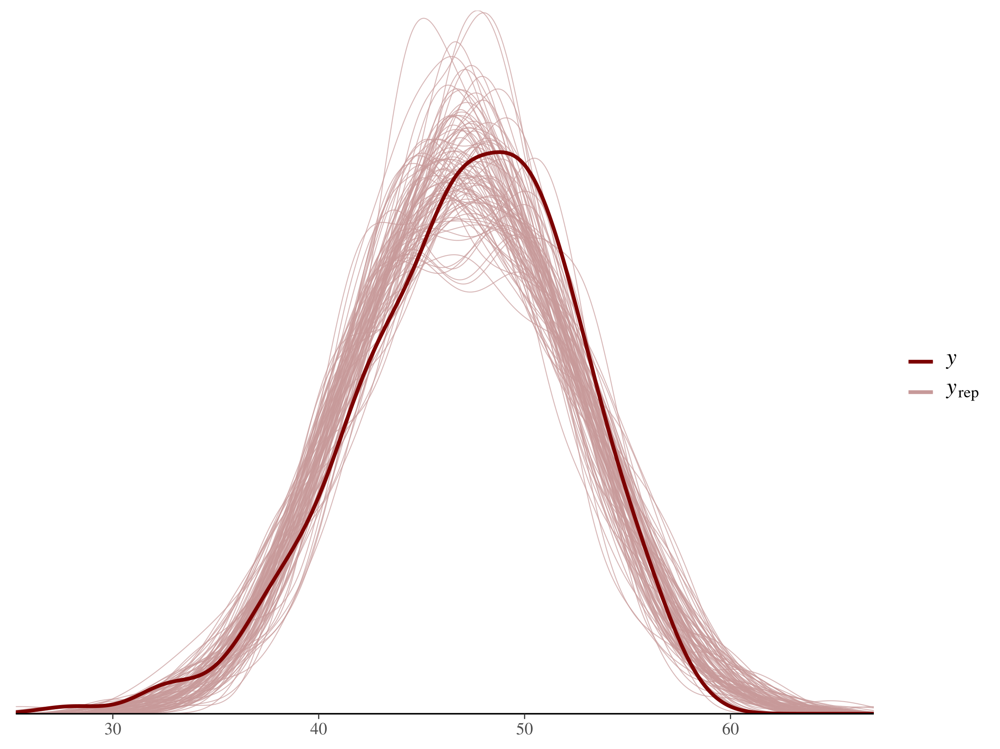
```

# Distribution of $y$ per group
```{r, echo = FALSE, fig.align = "center", out.width = "100%"}
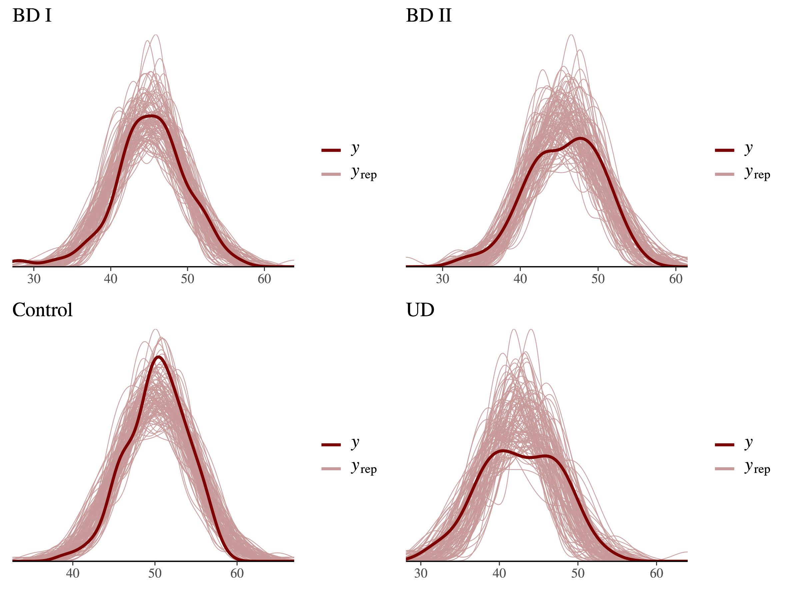
```

# Various statistics of $y$
```{r, echo = FALSE, fig.align = "center", out.width = "100%"}
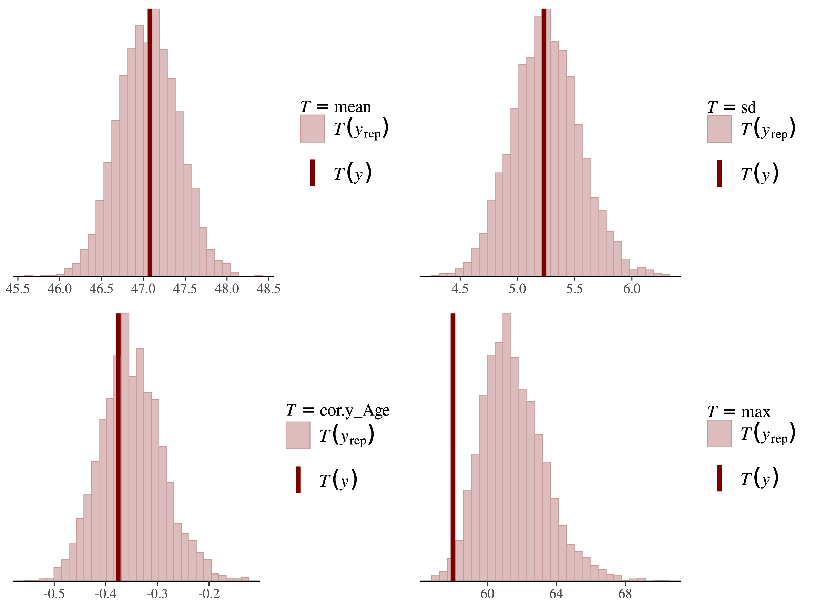
```

# Posterior predictive checks
So the ANCOVA model seems to fit the data well.
\vfill
How does the seemingly worse baseline $\mathcal{M}_1$ model do?
\vfill

# Distribution of $y$
```{r, echo = FALSE, fig.align = "center", out.width = "90%"}
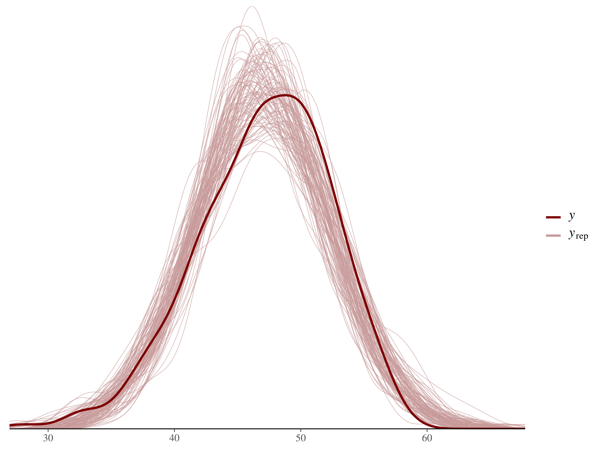
```
\vfill
Not that bad!!\newline
(But only because $y\approx\mathcal{N}(\cdot)$, _which need not happen in general_).

# Distribution of $y$ per group
```{r, echo = FALSE, fig.align = "center", out.width = "90%"}
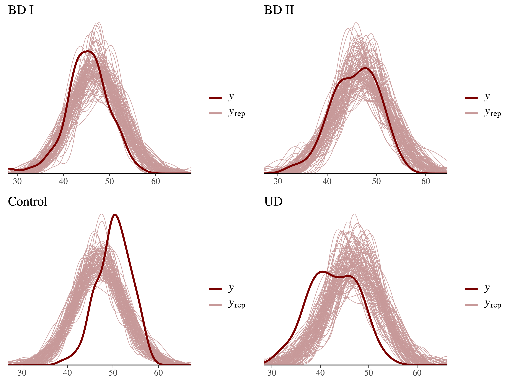
```
\vfill
Humm, the Control and UD groups are misspecified.\newline
(Of course, `Group' was not modelled\ldots)

# Various statistics of $y$
```{r, echo = FALSE, fig.align = "center", out.width = "90%"}
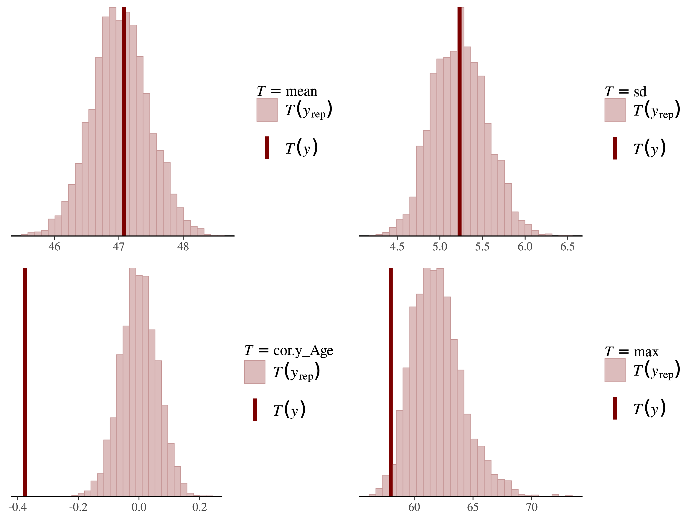
```
$\text{cor}(y, \text{Age})$ completely missed.\newline
(Of course, `Age' was not modelled\ldots)

# 
\begin{center}
\LARGE \textcolor{bullets}{Model comparison}
\end{center}
\vfill

# Leave-one-out cross validation (LOO-CV)

\textcolor{bullets}{Idea:}

- Models are compared based on out-of-sample _expected predictive accuracy_.
- LOO-CV is efficiently approximated by means of PSIS-LOO\newline
(Pareto smoothed importance sampling).
\vfill

\textcolor{bullets}{Interpretation:}

- PSIS-LOO essentially provides a means to \textcolor{bullets}{rank} models.
- It doesn't really quantify differences between models.
- However, as a \href{https://discourse.mc-stan.org/t/interpreting-output-from-compare-of-loo/3380/2}{rule of thumb}, consider values of _elpd\_diff_ at least 4 times as large as its SE as noteworthy.

# Leave-one-out cross validation (LOO-CV)
\begin{center}
\footnotesize 
\begin{tabular}{lrrr}
\toprule
Model  & elpd\_diff & se\_diff & looic\\
\midrule
$y \sim \text{Group} + \text{Age}$ (ANCOVA) & 0.0 & 0.0 & 1589.8\\
$y \sim \text{Group} + \text{Age} + \text{Group} \times \text{Age}$ & $-2.4$ & 1.2 & 1594.6\\
$y \sim \text{Group}$ & $-11.5$ & 4.2 & 1612.7\\
$y \sim \text{Group} + \text{Age}, \mu_\text{Control}=\mu_\text{UD}$ & $-18.4$ & 7.1 & 1626.7\\
$y \sim \text{Age}$ & $-38.3$ & 7.9 & 1666.4\\
$y \sim 1$ & $-58.1$ & 8.6 & 1706.1\\
\bottomrule
\end{tabular}
\normalsize 
\end{center}
\vfill

- Models are ordered from best to worst.
- Thus, ANCOVA appears to have the best predictive ability.
- Based on the '4SEs' rule of thumb, we discard the last two models.

# Bayes factors

I also tried to compare models using Bayes factors.
\newline
I have \href{https://osf.io/t5xfd/}{a lot to say about BFs}, not all of it is good.
\vfill

\textcolor{bullets}{Idea:}
\newline
Bayes factors compare the models' predictive ability \textit{for the observed data}. Thus:
\newline
\begin{quote}
Under which model are the observed data more likely?
\end{quote}
\vfill

Unfortunately, the results were _tremendously_ sensitive to prior specification.
\newline
I decided to leave them out.

# 
\begin{center}
\LARGE \textcolor{bullets}{Summarize and report inferences}
\end{center}
\vfill

# Plots per groups
```{r, echo = FALSE, fig.align = "center", out.width = "100%"}
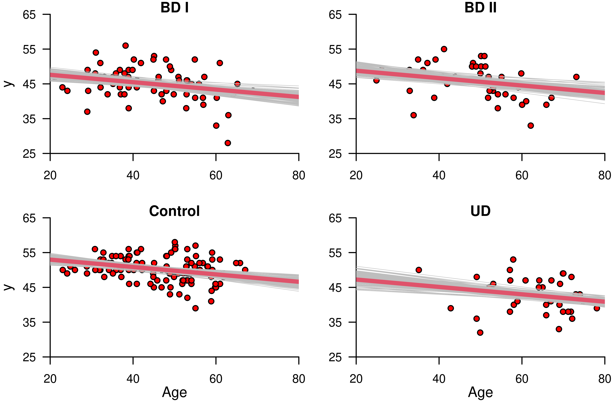
```

# Contrast: $\mu_\text{Control} - \mu_\text{UD} = 0$
```{r, echo = FALSE, fig.align = "center", out.width = "100%"}
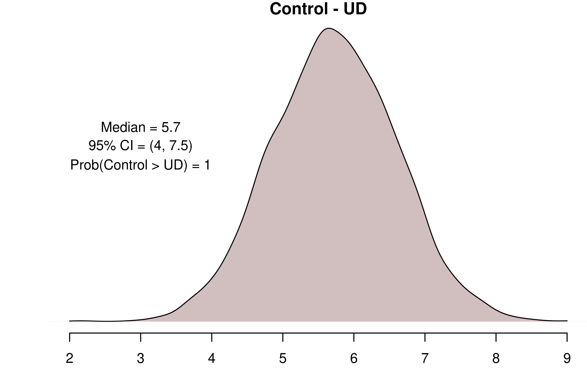
```

# All pairwise contrasts
```{r, echo = FALSE, fig.align = "center", out.width = "100%"}
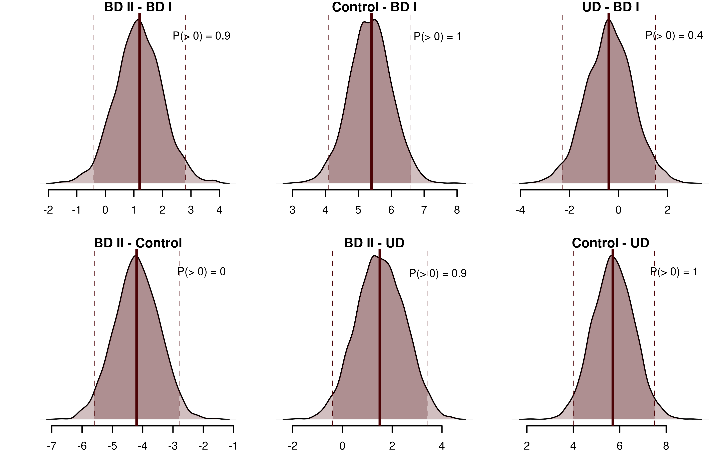
```

# Prediction for one subject
```{r, echo = FALSE, fig.align = "center", out.width = "100%"}
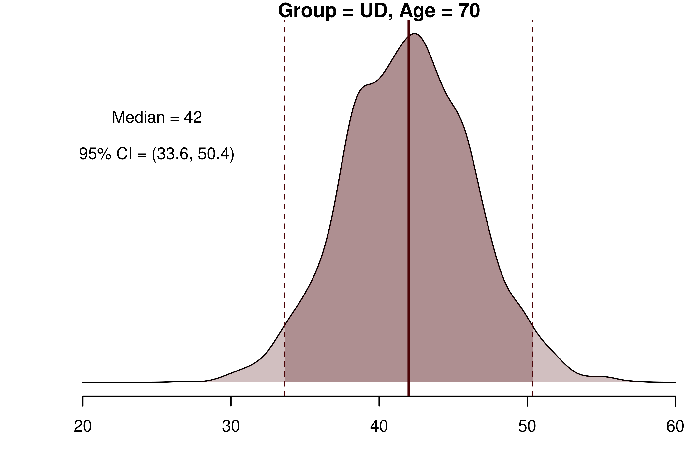
```

# Posterior dists. $\sigma$, $R^2$
```{r, echo = FALSE, fig.align = "center", out.width = "100%"}
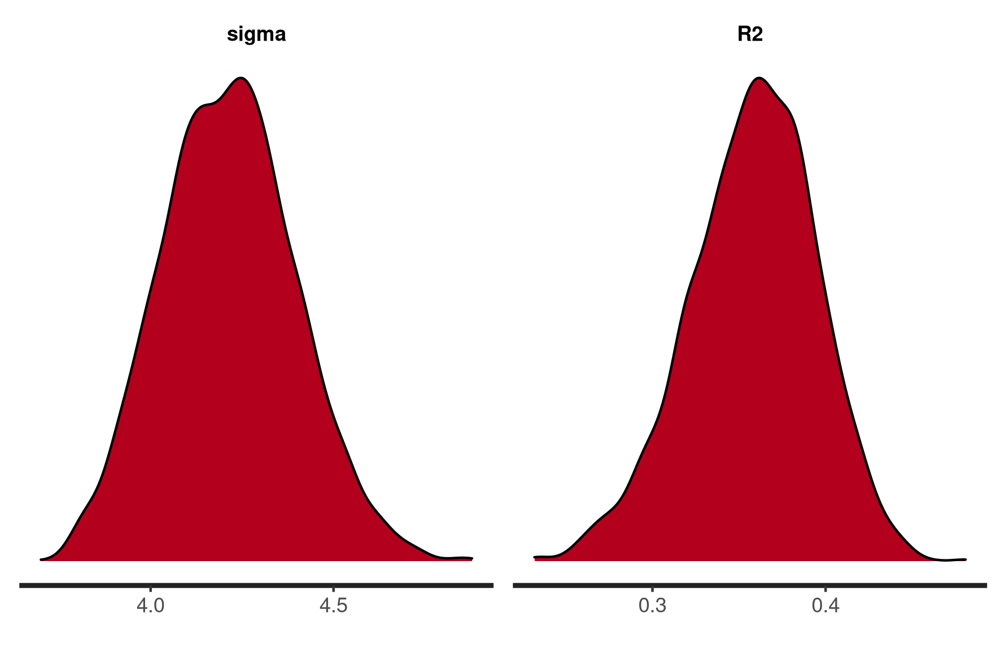
```

# Summary

\begin{center}
\begin{tabular}{lrrrr}
\toprule
  & Mean & SD & 2.5\% & 97.5\%\\
\midrule
beta[1] & 49.73 & 1.14 & 47.46 & 51.94\\
beta[2] & 1.17 & 0.81 & $-0.40$ & 2.79\\
beta[3] & 5.36 & 0.64 & 4.08 & 6.61\\
beta[4] & $-0.36$ & 0.95 & $-2.27$ & 1.51\\
beta[5] & $-0.11$ & 0.02 & $-0.15$ & $-0.06$\\
\midrule
sigma & 4.21 & 0.18 & 3.88 & 4.58\\
R2 & 0.36 & 0.04 & 0.28 & 0.42\\
\bottomrule
\end{tabular}
\end{center}
\vfill

# Conclusion

Bayesian modelling is _very_ flexible:

- Checking model fit is very _intuitive_ and _visual_.
- It is not _that_ difficult to adapt the model, if needed be.
- It is possible to perform _any_ inference that is a functional form of the data or model parameters.
- It is possible to compare models, for various predictive criteria.
- No statistical significance required.
- All outcomes are _stochastic_: \newline
You get to report the _uncertainty_ in your results.
- The sky is the limit:\newline
The types of models available are nearly endless.
\vfill

Now \textcolor{bullets}{you} give it a go!
